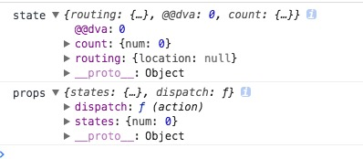

安装依赖
$ npm i dva --save-dev

### 案例1

新建项目目录如下
```
[dva]
  |-- src
    |-- index.html
    |-- index.js
    |-- index.less
  |-- package.json
  |-- webpack.config.js
```

<font color="deeppink">dva/package.json</font>
```json
{
  "name": "demo",
  "version": "1.0.0",
  "description": "",
  "main": "index.js",
  "entry": {
    "index": "./src/index.js"
  },
  "scripts": {
    "dev": "dora --plugins webpack",
    "build": "atool-build"
  },
  "author": "",
  "license": "ISC",
  "devDependencies": {
    "atool-build": "^1.0.2",
    "dora": "^0.5.0",
    "dora-plugin-webpack": "^1.0.0",
    "dva": "^2.1.0",
    "react": "^16.2.0",
    "react-dom": "^16.2.0"
  }
}
```

<font color="deeppink">dva/webpack.config.js</font>
```js
var webpack = require('atool-build/lib/webpack');

module.exports = function(webpackConfig) {
  // 拷贝html
  module.exports = function(webpackConfig) {
    webpackConfig.module.loaders.push({ test: /\.html$/, loader: 'file?name=[name].[ext]' })
  
    return webpackConfig;
  };
  // 删除common
  webpackConfig.plugins.some(function(plugin, i){
    if(plugin instanceof webpack.optimize.CommonsChunkPlugin || plugin.constructor.name === 'CommonsChunkPlugin') {
      webpackConfig.plugins.splice(i, 1);
      return true;
    }
  });
  // 返回 webpack 配置对象
  return webpackConfig;
};
```

<font color="deeppink">dva/src/index.html</font>
```html
<!DOCTYPE html>
<html lang="en">
<head>
  <meta charset="UTF-8">
  <title>webpackDemo</title>
  <meta content="width=device-width, initial-scale=1.0, maximum-scale=1.0, user-scalable=0" name="viewport">
  <link rel="stylesheet" href="./index.css">
</head>
<body>
  <div id="root"></div>
</body>
<script src="./index.js"></script>
</html>
```

<font color="deeppink">dva/src/index.less</font>
```less
.count {
  button {
    height: 60px;
    width: 60px;
    background: #333;
    font-size: 50px;
    text-align: center;
    line-height: 60px;
    font-weight: bold;
    color: #fff;
    outline: none;
  }
}
```

<font color="deeppink">dva/src/index.js</font>
```js
import React from 'react';
import dva, { connect } from 'dva';
import './index.html';
import './index.less';

// 初始化
const app = dva();

// 新建一个组件
class Count extends React.Component {
  render() {
    return (
      <div className="count">
        <h2> 0 </h2>
        <button onClick={() => { console.log('+')}}>+</button>
        <button onClick={() => { console.log('-')}}>-</button>
      </div>
    )
  }
}

// 注册路由表
app.router(() => <Count />);

// 启动应用
app.start('#root');
```

$ npm run dev , http://localhost:8000/ , 效果如下


<font color="deeppink">dva/src/index.js</font>
```js
import React from 'react';
import dva, { connect } from 'dva';
import './index.html';
import './index.less';

// 初始化
const app = dva();

// 注册 model
app.model({
  // namespace : model 的命名空间，同时也是他在全局 state 上的属性，只能用字符串，不支持通过 . 的方式创建多层命名空间。
  namespace: 'count',
  // 初始值
  state: {
    num: 0,
  }
});

// 新建一个组件
class Count extends React.Component {
  render() {
    console.log('props', this.props)
    const {states} = this.props;
    return (
      <div className="count">
        <h2> {states.num} </h2>
        <button onClick={() => { console.log('+')}}>+</button>
        <button onClick={() => { console.log('-')}}>-</button>
      </div>
    )
  }
}

// 该函数返回一个对象，建立 State 到 Props 的映射关系。
function mapStateToProps(state) {
  console.log('state', state)
  return {
    states: state.count
  };
}

const App = connect(mapStateToProps)(Count);

// 注册路由表
app.router(() => <App />);

// 启动应用
app.start('#root');
```

打印出来的 console 如下所示



打印出来的"state" 里 ，这里的 count: {num: 0} , count 就是 model 里的 namespace , {num: 0} 就是 model 里的state

通用 connect(mapStateToProps)(Count) 后，将 state 的一些属性映射到了 Count 组件的 this.props 属性中 , 如打印出来的 “props”

<font color="deeppink">dva/src/index.js</font>
```js
import React from 'react';
import dva, { connect } from 'dva';
import './index.html';
import './index.less';

// 初始化
const app = dva();

// 注册 model
app.model({
  // namespace : model 的命名空间，同时也是他在全局 state 上的属性，只能用字符串，不支持通过 . 的方式创建多层命名空间。
  namespace: 'count',
  // 初始值
  state: {
    num: 0,
  },
  
  // reducers
  reducers: {
    add  (state, action) {
      console.log('+  ', state, action)
      return {
        num: state.num + 1
      } 
    },
    minus(state, action) { 
      console.log('-  ',state, action )
      return {
        num: state.num - 1
      } 
    },
  }
});

// 新建一个组件
class Count extends React.Component {
  render() {
    const { states, dispatch } = this.props;
    return (
      <div className="count">
        <h2> {states.num} </h2>
        <button onClick={() => { dispatch({type: 'count/add'}) }}>+</button>
        <button onClick={() => { dispatch({type: 'count/minus'}) }}>-</button>
      </div>
    )
  }
}

// 该函数返回一个对象，建立 State 到 Props 的映射关系。
function mapStateToProps(state) {
  return {
    states: state.count
  };
}

const App = connect(mapStateToProps)(Count);

// 注册路由表
app.router(() => <App />);

// 启动应用
app.start('#root');
```

效果如下


